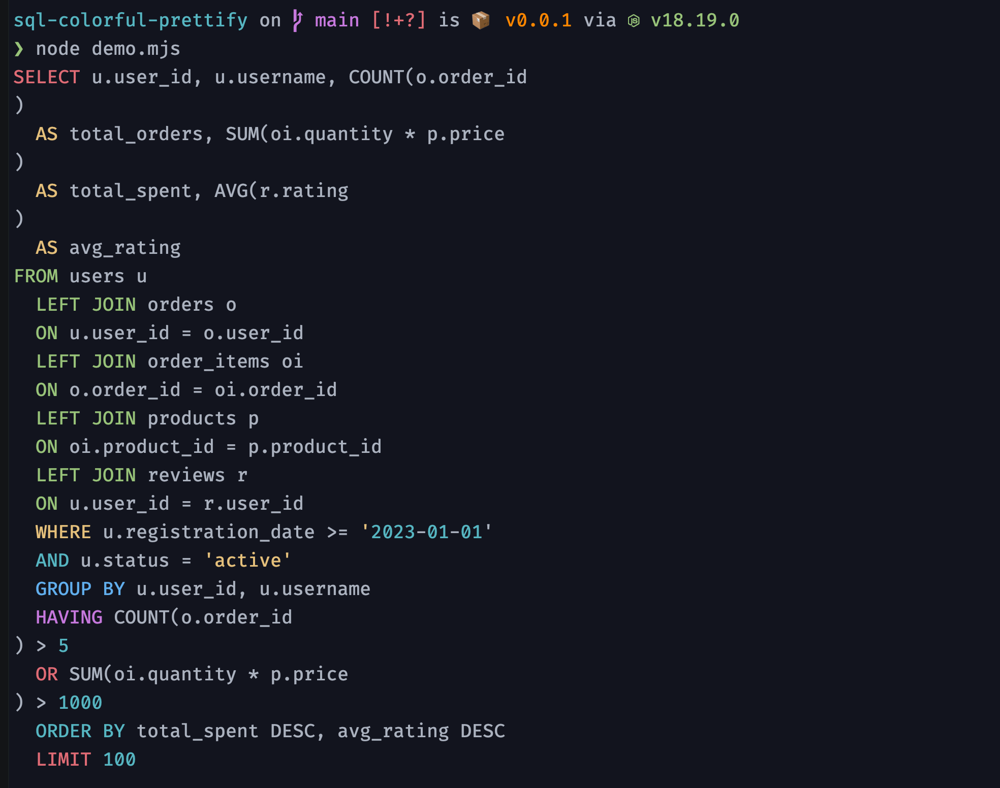

# sql-colorful-prettify

A lightweight SQL colorizer and formatter with no external dependencies.

## Installation

```bash
npm install sql-colorful-prettify
```

## Usage

```typescript
import { colorizeSQL, beautifyAndColorizeSQL, setColorScheme } from 'sql-colorizer';

// Colorize SQL
const colorized = colorizeSQL("SELECT * FROM users WHERE id = 1");

// Beautify and colorize SQL
const beautified = beautifyAndColorizeSQL("SELECT * FROM users WHERE id = 1");

// Customize color scheme
setColorScheme({
  SELECT: '\x1b[31m',  // Red
  FROM: '\x1b[32m',    // Green
  // ... other customizations
});
```

## Demo

```typescript
const sqlQuery = "SELECT u.user_id, u.username, COUNT(o.order_id) AS total_orders, SUM(oi.quantity * p.price) AS total_spent, AVG(r.rating) AS avg_rating FROM users u LEFT JOIN orders o ON u.user_id = o.user_id LEFT JOIN order_items oi ON o.order_id = oi.order_id LEFT JOIN products p ON oi.product_id = p.product_id LEFT JOIN reviews r ON u.user_id = r.user_id WHERE u.registration_date >= '2023-01-01' AND u.status = 'active' GROUP BY u.user_id, u.username HAVING COUNT(o.order_id) > 5 OR SUM(oi.quantity * p.price) > 1000 ORDER BY total_spent DESC, avg_rating DESC LIMIT 100";

console.log(beautifyAndColorizeSQL(sqlQuery));
```



## API

- `colorizeSQL(sql: string): string`: Colorizes the input SQL string.
- `beautifyAndColorizeSQL(sql: string): string`: Formats and colorizes the input SQL string.
- `setColorScheme(scheme: Partial<ColorScheme>): void`: Customizes the color scheme.

## Configuration

You can customize the color scheme by calling `setColorScheme` with a partial color scheme object. The default color scheme can be found in `src/config.ts`.